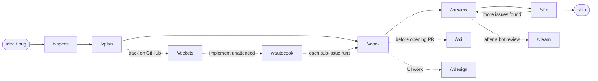

# vskills

🌐 English | [Tiếng Việt](README.vi.md)

Personal Claude Code skills — opinionated checklists layered on top of everyday coding tasks: spec, plan, implement, ship, and the ops work around all of that (track on GitHub, run unattended, review, fix, redesign, keep CLAUDE.md sharp, undo a bad migration).

Each skill is a `SKILL.md` (English) + `SKILL.vi.md` (Vietnamese) pair, invoked directly by name — `/vcook plans/my-feature`. No plugin/marketplace layer, no config file to maintain: plain Claude Code skills, symlinked from this repo into `~/.claude/skills`.

## Skills

### Core pipeline — idea to shipped code

| Skill | What it does | When to use |
|---|---|---|
| `vspecs` | Writes/updates a feature's specs through an iterative loop: scout the codebase + research real-world usage → brainstorm edge cases with the user → write plain-language decisions (no code, no file:line, no "implemented" status). | Starting a new feature and there's no specs file yet. |
| `vplan` | Turns a specs file into an implementation plan: verifies every case against the actual code (PASS/FAIL/MISSING, not guessed), adds baseline cases the specs missed, then writes `plan.md` + one `phase-XX-*.md` per case group — migrations consolidated into phase 1. | Specs exist; need a concrete, phased plan to code from. |
| `vcook` | Implements via a mandatory 9-step checklist: branch → plan-or-no-plan mode → tests first → build BE+FE fully → generated SDK client only (no raw fetch) → review against CLAUDE.md → tests green → commit → PR from the repo's template. | Have a plan (or just a quick description) and need working code + a PR out the other end. |
| `vreview` | Reviews a diff/PR/branch/directory as a senior reviewer: a mandatory automated lint pre-scan, then parallel subagents per file group, a synthesis pass, an adversarial second look, and a spot-check on every CRITICAL finding before it's trusted. Supports incremental re-review (only re-reviews what changed since the last run) and an opt-in `--harvest` pass that turns recurring findings into new lint rules. Writes `.code-review/REPORT.md`, grouped CRITICAL/WARNING/SUGGESTION. | Before merging — review a branch, an open PR, or a whole directory. |
| `vfix` | Fixes a `vreview` report in a fixed, safe order: lint-confirmed violations → CRITICAL → WARNING → cross-group issues → SUGGESTION (each one asked, never bulk-applied). Stops and asks before anything risky — a migration, a data-mutating fix, or a change to a package shared by 2+ apps. | A `.code-review/` report exists and needs fixing without guessing at priority. |

### Scale that up — GitHub-tracked, unattended

| Skill | What it does | When to use |
|---|---|---|
| `vtickets` | Creates or syncs a GitHub epic + sub-issues from a plan directory — non-technical issue bodies, sub-issues grouped by related phases (not 1:1), migrations called out in whichever sub-issue holds phase 1. Idempotent: re-running updates instead of duplicating. | Need to track a `vplan` plan on GitHub for a PM or non-technical stakeholder. |
| `vautocook` | Implements every sub-issue of a GitHub epic in sequence, unattended: orders them into a dependency chain, shows you the plan for confirmation, then runs an isolated headless `/vcook` per sub-issue (its own branch + PR), resumable and fail-fast. High blast radius by design — always confirm the plan before it runs. | Have an epic (e.g. from `vtickets`) and want it implemented overnight, not one `/vcook` at a time. |

### Support

| Skill | What it does | When to use |
|---|---|---|
| `vci` | Typecheck + build + lint + format (+ optional test) across a JS/TS repo, in parallel, auto-detecting the package manager/workspace/scripts — no hardcoded package names. | Quick, full-repo sanity check before a commit or PR, in any JS/TS repo (monorepo or single package). |
| `vdesign` | Redesigns a page/component/PR's UI to a high execution bar (refined, harmonious, modern, elegant, accessible). No depth flag — every run opens by asking the user to pick 18 explicit style/structure criteria (typography, color, motion, layout, boldness, and more), synthesized into a concrete design brief before any code changes. | Need to upgrade the UI/UX of an existing page, component, feature, or PR. |
| `vlearn` | Reads a bot's PR review comments (one PR, or `--last N` merged PRs), clusters recurring patterns, cross-checks them against existing `CLAUDE.md` rules, and proposes new ones for the gaps — plus flags existing rules with zero recent hits as removal candidates. | A review bot just finished commenting on a PR (or several), and it's worth distilling into a standing rule. |
| `vrollback` | Rolls back one migration on the **local** DB and deletes its tracking record, as if it never ran — auto-detects the ORM (Drizzle/Prisma/Knex/TypeORM/raw SQL), the DB engine, and the Docker container. Refuses anything that isn't clearly local, always confirms, always backs up first. | Ran the wrong migration locally and need it gone, tracking record included. |

Full detail lives in each `skills/<name>/SKILL.md`.

## Workflow



`/vrollback` runs independently whenever a local migration needs undoing — not part of this pipeline.

## Use cases

**Build a feature end to end** — you have an idea, nothing exists yet:
```bash
/vspecs Feature: appointment rebooking
/vplan plans/specs/appointment-rebooking.md
/vcook plans/appointment-rebooking
/vreview
/vfix
```
→ specs → plan (migrations squashed into one phase) → code + tests + PR → 4-phase review → fix by priority.

**Fix a bug quickly, no plan needed:**
```bash
/vcook Fix the datepicker not disabling past dates on the booking form
```
→ `vcook` auto-detects "no-plan mode": creates a branch, codes, tests, opens a PR — skips reading a plan.

**Review a teammate's branch:**
```bash
/vreview feat/payment-refund --base develop
# or review an already-open PR directly:
/vreview #482
# or add a lint-harvest pass on top:
/vreview --harvest
```
→ produces `.code-review/REPORT.md`, grouped by CRITICAL/WARNING/SUGGESTION; re-running the same target only re-reviews what changed since last time.

**Make sure the whole monorepo still builds before opening a PR:**
```bash
/vci
```
→ typecheck + build + lint + format every package in the workspace in parallel (background commands), auto-fixes on failure.

**Track a large plan on GitHub for a PM/non-technical stakeholder:**
```bash
/vtickets plans/appointment-rebooking
```
→ creates an epic issue + sub-issues grouped by related phases, plain non-technical language, idempotent (re-running doesn't create duplicates).

**Implement that whole epic unattended, overnight:**
```bash
/vautocook https://github.com/<owner>/<repo>/issues/<epic_number>
```
→ orders the sub-issues into a dependency chain, shows you the plan, then — once you confirm — runs an isolated headless `/vcook` per sub-issue (its own branch + PR), resumable, fail-fast.

**Redesign a page's UI:**
```bash
/vdesign /clients/[id]?tab=notes
```
→ screenshots the page (or reads the component tree for a non-URL target), asks 18 style/structure questions once, audits against a ~100-item checklist, fixes everything the audit found, then verifies (screenshot diff, accessibility check, adversarial re-audit for structural changes).

**A review bot just commented on your PR — turn its feedback into a standing rule:**
```bash
/vlearn 482
# or across the last 20 merged PRs:
/vlearn --last 20
```
→ clusters recurring comment patterns, checks them against existing CLAUDE.md rules, proposes new ones for real gaps (never auto-applied — you approve each one).

**Accidentally ran the wrong migration locally:**
```bash
/vrollback 0007_add_appointment_status
```
→ auto-detects ORM/DB/container, rolls back + deletes the tracking record — local DB only, always confirms before running.

## Install

```bash
git clone git@github.com:vyvu99/vskills.git
cd vskills
./install.sh                       # symlink skills/ → ~/.claude/skills (English)
./install.sh --lang=vi             # same, but installs the Vietnamese SKILL.vi.md variant
./install.sh --with-scripts        # + symlink top-level scripts/lint-rules (personal, opt-in)
./install.sh --with-claude-md      # + copy a generic starter ~/.claude/CLAUDE.md (opt-in, skipped if you already have one)
./install.sh --dry-run             # preview only
```

Skills are symlinked, not copied — editing a `SKILL.md` in `~/.claude/skills/` or in this repo is the same file. Every skill has a Vietnamese translation (`SKILL.vi.md` next to `SKILL.md`) — pick the language once at install time with `--lang`, both can't be active at once.

A skill that bundles its own scripts (currently just `vautocook`'s `plan_tasks.py`/`run_tasks.py`) gets that `scripts/` folder symlinked automatically, no flag needed — that's different from `--with-scripts` above, which only covers the top-level, opt-in `scripts/lint-rules/` (rules harvested from `vreview` on the author's own projects, may not fit yours).

`vreview`, `vcook`, and `vlearn` read/write `~/.claude/CLAUDE.md` directly — if you don't already have one, `--with-claude-md` copies a generic starter (`claude-md/CLAUDE.md`) into place. It's copied, not symlinked, since you're expected to customize it right away; if `~/.claude/CLAUDE.md` already exists, install.sh warns and leaves it untouched.

## How to use

Each skill is invoked directly by name, e.g. `/vcook plans/my-feature`. No plugin/marketplace layer — these are plain Claude Code skills.

**Quick decision tree:**

```
I have a coding task
│
├─ "Need to write specs for a new feature"
│  └─ /vspecs
│
├─ "Have specs, need an implementation plan"
│  └─ /vplan
│
├─ "Have a plan (or just a quick description), need to code"
│  └─ /vcook
│
├─ "Need to review a branch/PR"
│  └─ /vreview
│
├─ "Have a review report, need to fix it"
│  └─ /vfix
│
├─ "Need typecheck + build before committing"
│  └─ /vci
│
├─ "Need to create/sync GitHub issues from a plan"
│  └─ /vtickets
│
├─ "Have an epic, want it implemented unattended"
│  └─ /vautocook
│
├─ "Need to redesign UI/UX"
│  └─ /vdesign
│
├─ "A bot just reviewed a PR, want to pull out a new rule"
│  └─ /vlearn
│
└─ "Need to roll back a migration locally"
   └─ /vrollback
```

---

## For maintainers

<details>
<summary>Structure, add/sync skills, lint rules</summary>

```
vskills/
├── install.sh          # symlink skills/ (+ top-level scripts/ if --with-scripts) into ~/.claude
├── skills/<name>/SKILL.md       # English
├── skills/<name>/SKILL.vi.md    # Vietnamese — same line count as SKILL.md (checked by scripts/check-skills.js)
├── skills/<name>/scripts/       # optional, always installed with the skill (e.g. vautocook's plan_tasks.py/run_tasks.py)
├── skills/<name>/references/    # optional, always installed with the skill (e.g. vreview's subagent prompts)
├── skills/_vskills-shared/repo-profile.md   # shared stack-detection reference, always symlinked (not opt-in)
└── scripts/<name>/      # e.g. lint-rules — a different thing from skills/<name>/scripts/ above, opt-in only
```

Symlinked — no manual sync step needed. Edit a skill either in `~/.claude/skills/<name>/SKILL.md` or in `skills/<name>/SKILL.md` here, it's the same file either way.

**Add a new skill:**
```bash
mkdir skills/<skill-name>
# write skills/<skill-name>/SKILL.md (+ SKILL.vi.md, same line count)
./install.sh
node scripts/check-skills.js   # lints frontmatter, description length, EN/VI line parity
git add . && git commit -m "feat: add <skill-name> skill"
```

**Add a lint rule after a `vreview` Phase 5 harvest:**

Phase 5 already writes (and chmods) new/updated rule scripts directly into the live `~/.claude/scripts/lint-rules/rules/` directory — symlinked from `scripts/lint-rules/rules/` in this repo when installed with `--with-scripts`. So there's no `cp` step, just commit what's already there:
```bash
git add . && git commit -m "feat(lint): add <rule-name> rule"
git push
```

</details>
