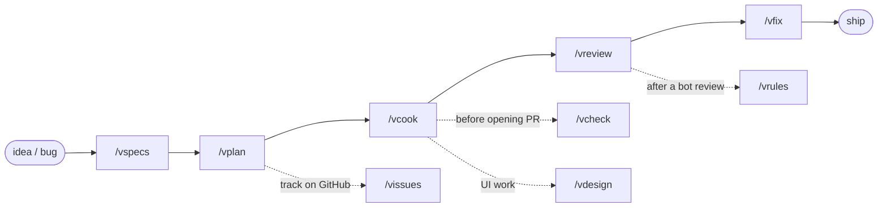

# vskills

🌐 English | [Tiếng Việt](README.vi.md)

Personal Claude Code skills — opinionated checklists layered on top of everyday coding tasks: plan, implement, review, fix, ship.

## Skills

| Skill | What it does | When to use |
|---|---|---|
| `vspecs` | Write/update specs for a feature through a brainstorm-edge-case loop | Starting a new feature, no specs yet |
| `vplan` | Build an implementation plan from specs — checks each case against current code | Specs exist, need a plan to code from |
| `vcook` | Implement via a 9-step checklist: branch, test-first, SDK client, review, PR | Have a plan (or a quick description), need to code |
| `vreview` | 6-phase code review using parallel subagents + an adversarial pass | Need to review a branch/PR |
| `vfix` | Fix issues from a `vreview` report in a fixed priority order | Have a review report that needs fixing |
| `vcheck` | Typecheck + build in parallel across a JS/TS workspace (any package manager) | Quick check before committing |
| `vissues` | Create/update a GitHub epic + sub-issues from a plan | Need to track a plan on GitHub |
| `vdesign` | Redesign UI/UX to a personal aesthetic (5 depth levels `--L1`-`--L5`, plus `--bold`) | Need to upgrade a page/component's UI |
| `vrules` | Extract patterns from a bot's PR review → propose a new CLAUDE.md rule | A bot just finished reviewing a PR |
| `vmigrate-rollback` | Roll back a migration on a local DB + delete its tracking record | Need to undo a migration locally |

Full detail lives in each `skills/<name>/SKILL.md`.

## Workflow



`/vmigrate-rollback` runs independently whenever a local migration needs undoing — not part of this pipeline.

## Use cases

**Build a feature end to end** — you have an idea, nothing exists yet:
```bash
/vspecs Feature: appointment rebooking
/vplan plans/specs/appointment-rebooking.md
/vcook plans/appointment-rebooking
/vreview
/vfix
```
→ specs → plan (migrations squashed into one phase) → code + tests + PR → 6-phase review → fix by priority.

**Fix a bug quickly, no plan needed:**
```bash
/vcook Fix the datepicker not disabling past dates on the booking form
```
→ `vcook` auto-detects "no-plan mode": creates a branch, codes, tests, opens a PR — skips reading a plan.

**Review a teammate's branch:**
```bash
/vreview feat/payment-refund --base develop
# or review an already-open PR directly:
/vreview #482
```
→ produces `.code-review/REPORT.md`, grouped by CRITICAL/WARNING/SUGGESTION.

**Make sure the whole monorepo still builds before opening a PR:**
```bash
/vcheck
```
→ typecheck + build every package in the workspace in parallel (background commands), auto-fixes on failure.

**Track a large plan on GitHub for a PM/non-technical stakeholder:**
```bash
/vissues plans/appointment-rebooking
```
→ creates an epic issue + sub-issues grouped by phase, plain non-technical language, idempotent (re-running doesn't create duplicates).

**Accidentally ran the wrong migration locally:**
```bash
/vmigrate-rollback 0007_add_appointment_status
```
→ auto-detects ORM/DB/container, rolls back + deletes the tracking record — local DB only, always confirms before running.

## Install

```bash
git clone git@github.com:vyvu99/vskills.git
cd vskills
./install.sh                       # symlink skills/ → ~/.claude/skills (English)
./install.sh --lang=vi             # same, but installs the Vietnamese SKILL.vi.md variant
./install.sh --with-scripts        # + symlink scripts/lint-rules (personal, opt-in)
./install.sh --with-claude-md      # + copy a generic starter ~/.claude/CLAUDE.md (opt-in, skipped if you already have one)
./install.sh --dry-run             # preview only
```

Skills are symlinked, not copied — editing a `SKILL.md` in `~/.claude/skills/` or in this repo is the same file. `scripts/lint-rules/` is skipped by default: those are rules harvested from `vreview` on the author's own projects and may not fit yours. Every skill has a Vietnamese translation (`SKILL.vi.md` next to `SKILL.md`) — pick the language once at install time with `--lang`, both can't be active at once.

`vreview`, `vcook`, and `vrules` read/write `~/.claude/CLAUDE.md` directly — if you don't already have one, `--with-claude-md` copies a generic starter (`claude-md/CLAUDE.md`) into place. It's copied, not symlinked, since you're expected to customize it right away; if `~/.claude/CLAUDE.md` already exists, install.sh warns and leaves it untouched.

## How to use

Each skill is invoked directly by name, e.g. `/vcook plans/my-feature`. No plugin/marketplace layer — these are plain Claude Code skills.

**Quick decision tree:**

```
I have a coding task
│
├─ "Need to write specs for a new feature"
│  └─ /vspecs
│
├─ "Have specs, need an implementation plan"
│  └─ /vplan
│
├─ "Have a plan (or just a quick description), need to code"
│  └─ /vcook
│
├─ "Need to review a branch/PR"
│  └─ /vreview
│
├─ "Have a review report, need to fix it"
│  └─ /vfix
│
├─ "Need typecheck + build before committing"
│  └─ /vcheck
│
├─ "Need to create/sync GitHub issues from a plan"
│  └─ /vissues
│
├─ "Need to redesign UI/UX"
│  └─ /vdesign
│
├─ "A bot just reviewed a PR, want to pull out a new rule"
│  └─ /vrules
│
└─ "Need to roll back a migration locally"
   └─ /vmigrate-rollback
```

---

## For maintainers

<details>
<summary>Structure, add/sync skills, lint rules</summary>

```
vskills/
├── install.sh          # symlink skills/ (+ scripts/ if --with-scripts) into ~/.claude
├── skills/<name>/SKILL.md
├── skills/_vskills-shared/repo-profile.md   # shared stack-detection reference, always symlinked (not opt-in)
└── scripts/<name>/      # e.g. lint-rules, opt-in only
```

Symlinked — no manual sync step needed. Edit a skill either in `~/.claude/skills/<name>/SKILL.md` or in `skills/<name>/SKILL.md` here, it's the same file either way.

**Add a new skill:**
```bash
mkdir skills/<skill-name>
# write skills/<skill-name>/SKILL.md
./install.sh
git add . && git commit -m "feat: add <skill-name> skill"
```

**Add a lint rule after a `vreview` Phase 5 harvest:**
```bash
cp .code-review/staged-lint-rules/*.sh scripts/lint-rules/rules/
git add . && git commit -m "feat(lint): add <rule-name> rule"
git push
```

</details>
