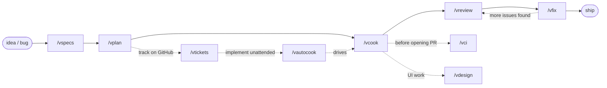

# vskills

🌐 English | [Tiếng Việt](README.vi.md)

Personal Claude Code skills covering the full lifecycle of a coding task: spec, plan, implement, review, fix, and ship — plus GitHub tracking, UI redesign, and local migration rollback.

Plain `SKILL.md` files, symlinked from this repo into `~/.claude/skills`. No plugin layer, no config file. Each skill ships in English (`SKILL.md`) and Vietnamese (`SKILL.vi.md`).

## Install

**Requirements:** Claude Code CLI, `git`, `bash`. `gh` is optional — GitHub-related skills degrade gracefully without it.

```bash
git clone git@github.com:vyvu99/vskills.git
cd vskills
./install.sh                       # symlink skills/ → ~/.claude/skills (English)
./install.sh --lang=vi             # Vietnamese variant
./install.sh --with-scripts        # + personal lint rules (opt-in)
./install.sh --with-claude-md      # + generic starter ~/.claude/CLAUDE.md (opt-in, skipped if one exists)
./install.sh --dry-run             # preview only
```

Skills are symlinked, not copied — edit either copy, it's the same file. Re-running `install.sh` removes any skill that was deleted from this repo since your last install.

## Skills

`*` — requires explicit invocation; the assistant will not trigger it automatically.

### Core pipeline

| Skill | Description | Example |
|---|---|---|
| `vspecs` | Writes or updates a feature's specs: researches the codebase and real-world usage, then works through edge cases with you. Output is plain language only — no code, no file references. | `/vspecs Feature: appointment rebooking` |
| `vplan` | Turns a specs file into a phased implementation plan, verifying every case against the actual code (PASS/FAIL/MISSING). | `/vplan plans/specs/appointment-rebooking.md` |
| `vcook`* | Implements a plan or task end to end: branch, tests first, code, generated-SDK-only API calls, CLAUDE.md review, PR. Stops on a dirty working tree or a plan/code mismatch. | `/vcook plans/appointment-rebooking` |
| `vreview` | Reviews a diff, PR, branch, or directory: lint pre-scan, parallel per-file review, synthesis, and an adversarial pass. Writes `.code-review/REPORT.md`. | `/vreview #482` |
| `vfix`* | Fixes a `vreview` report in priority order — lint, Critical, Warning, cross-group, Suggestion. Stops to confirm anything risky. | `/vfix` |

### GitHub tracking

| Skill | Description | Example |
|---|---|---|
| `vtickets`* | Creates or syncs a GitHub epic and sub-issues from a plan directory. Idempotent. | `/vtickets plans/appointment-rebooking` |
| `vautocook`* | Implements every sub-issue of a GitHub epic unattended, one at a time, each as its own PR. Requires confirmation before it starts; no fallback if `gh`/`claude` isn't available. | `/vautocook <epic-url>` |

### Support

| Skill | Description | Example |
|---|---|---|
| `vci` | Typecheck, build, and lint in parallel across a JS/TS repo; format and optional tests after. Auto-detects the package manager and workspace. | `/vci --changed` |
| `vdesign` | Redesigns a page or component's UI through a structured scan → audit → fix → verify process. Always starts by asking 18 style questions. | `/vdesign /clients/[id]` |
| `vrollback`* | Rolls back one applied migration on a confirmed-local database and removes its tracking record. Refuses non-local targets. | `/vrollback 0007_add_status` |

Full behavior, flags, and edge cases: `skills/<name>/SKILL.md`.

## Workflow


```mermaid
flowchart LR
    idea(["idea / bug"]) --> specs["/vspecs"]
    specs --> plan["/vplan"]
    plan --> cook["/vcook"]
    cook --> review["/vreview"]
    review --> fix["/vfix"]
    fix -. more issues found .-> review
    fix --> ship(["ship"])

    plan -. track on GitHub .-> tickets["/vtickets"]
    tickets -. implement unattended .-> auto["/vautocook"]
    auto -. drives .-> cook
    cook -. before opening PR .-> ci["/vci"]
    cook -. UI work .-> design["/vdesign"]
```

`/vrollback` runs independently — not part of this pipeline.

## Which skill do I need?

```
├─ "No specs yet for this feature"                 → /vspecs
├─ "Specs are ready, need an implementation plan"  → /vplan
├─ "Have a plan (or just a quick task), need code" → /vcook
├─ "Need to review a branch or PR"                 → /vreview
├─ "Have a review report, need to fix it"          → /vfix
├─ "Want a typecheck/build sanity check"           → /vci
├─ "Need to track a plan on GitHub"                → /vtickets
├─ "Have a GitHub epic, want it built unattended"  → /vautocook
├─ "Need to redesign a page's UI"                  → /vdesign
└─ "Ran the wrong migration locally"               → /vrollback
```

---

## For maintainers

<details>
<summary>Structure, add/remove skills, lint rules</summary>

```
vskills/
├── install.sh                    # symlink skills/ (+ scripts/ if --with-scripts) into ~/.claude
├── skills/<name>/SKILL.md        # English
├── skills/<name>/SKILL.vi.md     # Vietnamese, same line count (checked by scripts/check-skills.js)
├── skills/<name>/scripts/        # optional, installed with the skill
├── skills/<name>/references/     # optional, installed with the skill
├── skills/_vskills-shared/       # shared reference docs, always symlinked
└── scripts/<name>/               # e.g. lint-rules — opt-in, separate from skills/<name>/scripts/
```

**Add a skill:**
```bash
mkdir skills/<skill-name>
# write skills/<skill-name>/SKILL.md (+ SKILL.vi.md, same line count)
./install.sh
node scripts/check-skills.js   # lints frontmatter, description length, EN/VI parity
git add . && git commit -m "feat: add <skill-name> skill"
```

**Remove a skill:**
```bash
rm -rf skills/<skill-name>
grep -rl "<skill-name>" skills/ README.md README.vi.md   # catch cross-references
./install.sh   # cleans up the orphaned symlink under ~/.claude/skills
git add . && git commit -m "chore: remove <skill-name> skill"
```

**Add a lint rule after a `vreview --harvest` pass:**

Phase 5 writes the rule script directly into `~/.claude/scripts/lint-rules/rules/` (symlinked from `scripts/lint-rules/rules/` when installed with `--with-scripts`) — just commit what's already there:
```bash
git add . && git commit -m "feat(lint): add <rule-name> rule"
git push
```

</details>

## License

[MIT](LICENSE)
