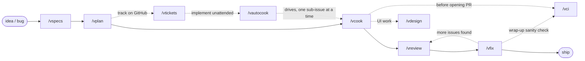

# vskills

🌐 English | [Tiếng Việt](README.vi.md)

**Personal Claude Code skills for the full lifecycle of a coding task** — spec, plan, implement, review, fix, ship, plus the ops work around it (track on GitHub, run unattended, redesign UI, keep `CLAUDE.md` sharp, undo a bad migration).

Opinionated on purpose: each skill encodes one specific, hard-won way of doing a task well, not a menu of options. No plugin/marketplace layer, no config file to maintain — plain `SKILL.md` files, symlinked from this repo into `~/.claude/skills`, invoked directly by name (`/vcook plans/my-feature`).

## Why this exists

Ad-hoc prompting for "review this PR" or "implement this plan" gets inconsistent results — the quality depends on how well you happened to phrase it that day. Each skill here is a fixed, battle-tested checklist for one recurring task, so the same input produces the same rigor every time: `vreview` always pre-scans lint before touching a diff, `vcook` always writes tests before code, `vfix` always fixes in the same safe priority order. You stop re-explaining your standards in every prompt.

Every skill ships in two languages — `SKILL.md` (English) and `SKILL.vi.md` (Vietnamese), line-count-matched and checked by CI — pick one at install time.

## Skills

👤 next to a name means the skill only runs when you type it — the assistant won't reach for it on its own (`disable-model-invocation: true`). The rest, it may pick up automatically when the moment fits.

### Core pipeline — idea to shipped code

| Skill | What it does | When to use |
|---|---|---|
| `vspecs` | Writes/updates a feature's specs through an iterative loop: two isolated recon subagents (codebase scout + real-world web research, kept separate on purpose) → classifies the situation and **stops for your confirmation** → rounds of edge-case brainstorming (P0/P1/P2, chat or a generated webapp) → an Experience Specs phase (what the user sees/does/feels) → a self-check pass (6 hard checks; any question still open after 3 rounds gets force-resolved). Output is plain language only — no code, no file:line, no "implemented" status; specs are capped at ~1-3 pages, split into more files past that. | Starting a new feature with no specs file yet, or reconciling specs against code that's already been built. |
| `vplan` | Reads a specs file end to end and scouts the codebase, then verifies **every** case against the real code — PASS/FAIL/MISSING with a file:line, never guessed — adds baseline edge cases the specs missed, and writes `plan.md` + one `phase-XX-*.md` per case group (migrations default into a single phase 1 unless a migration is provably independent). A final cross-check gate catches untracked cases and orphan phases before offering a 3-way handoff: implement now, track on GitHub first, or stop here. | Specs exist; need a concrete, phased plan to code from. |
| `vcook` 👤 | Implements via a mandatory 9-step checklist: resolve branch + PR base → detect plan-or-no-plan mode → write failing tests first (mandatory for backend/API, explicitly justified skip for pure UI) → implement BE+FE fully → generated SDK client only (raw `fetch`/`axios` forbidden) → full CLAUDE.md review of the diff → run the whole suite until green, then actually exercise the change once → commit → PR from the repo's template. **Hard-stops** on a dirty working tree or a plan/code mismatch before writing any code; resumable after an interruption; degrades to a manual paste-ready PR body without `gh`. | Have a plan (or just a quick description) and need working code + a PR out the other end. |
| `vreview` | Reviews a diff/PR/branch/directory as a senior reviewer: a mandatory automated lint pre-scan, then parallel subagents per file group, a synthesis pass, an adversarial second look, and a spot-check on **every** CRITICAL finding (not just the adversarial pass's) before it's trusted. Supports incremental re-review (only re-reviews what changed since the last run — same commit re-run just replays the prior report) and an opt-in `--harvest` pass that turns recurring findings into new lint rules. Writes `.code-review/REPORT.md`, grouped CRITICAL/WARNING/SUGGESTION/CROSS-GROUP. | Before merging — review a branch, an open PR, or a whole directory. |
| `vfix` 👤 | Fixes a `vreview` report in a fixed, safe order: lint-confirmed violations → CRITICAL → WARNING → cross-group issues → SUGGESTION (reviewed one at a time, or via a batch webapp list — never bulk-applied either way). Stops and asks before anything risky — a migration, an UPDATE/DELETE on existing data, or a change to a package shared by 2+ apps. Writes status back into the report as it goes, runs `vci` on touched packages, and asks before deleting `.code-review/` when done. | A `.code-review/` report exists and needs fixing without guessing at priority. |

### Scale that up — GitHub-tracked, unattended

| Skill | What it does | When to use |
|---|---|---|
| `vtickets` 👤 | Creates or syncs a GitHub epic + sub-issues from a plan directory — non-technical issue bodies, sub-issues grouped by related area of work (not 1:1 per phase), migrations called out in whichever sub-issue holds phase 1. Fully idempotent — a cache file + hidden marker + title-search discovery chain means re-running only updates, never duplicates — and it degrades to printing paste-ready issue bodies if GitHub/`gh` isn't available, rather than aborting. Never creates a new GitHub label without asking first. | Need to track a `vplan` plan on GitHub for a PM or non-technical stakeholder. |
| `vautocook` 👤 | Implements every sub-issue of a GitHub epic in sequence, unattended: plans a dependency order, shows it to you and **hard-stops for explicit go-ahead**, then runs an isolated headless `/vcook` per sub-issue (its own branch + PR, stacked on its dependency's branch), resumable, fail-fast the moment a task ends without a PR. No degraded mode — needs a real GitHub epic (e.g. from `vtickets`), authenticated `gh`, and the `claude` CLI on PATH; once approved, can run unattended for hours. | Have an epic and want it implemented overnight, not one `/vcook` at a time. |

### Support

| Skill | What it does | When to use |
|---|---|---|
| `vci` | Typecheck, build, and lint run in parallel per package; format and an optional test step run after. Auto-detects the package manager/workspace/scripts (prefers `turbo`/`nx` if either is configured at root) — no hardcoded package names, ever. `--changed` scopes the run to packages touched since the base branch; a failing package is fixed and only that package re-runs, and re-invoking after an interruption reuses the logs already produced instead of starting over. | Quick, full-repo sanity check before a commit or PR, in any JS/TS repo (monorepo or single package). |
| `vdesign` | Redesigns a page/component/PR's UI to a high execution bar (refined, harmonious, modern, elegant, accessible) through 5 named phases — Scope → Scan → Audit (~100-item checklist) → Fix → Verify. No depth flag — **every** run opens by asking 18 explicit style/structure criteria (typography, color, motion, layout, boldness, and more; chat or a generated webapp), synthesized into a concrete design brief before any code changes. A multi-component target gets one pilot cluster redesigned and approved first, then the same design language propagates to the rest. Ends with a screenshot diff, an accessibility check, and a mandatory anti-slop gate (no generic gradients, no placeholder data, no 3+ identical cards). | Need to upgrade the UI/UX of an existing page, component, feature, or PR. |
| `vrollback` 👤 | Rolls back one already-applied migration on a **confirmed-local** DB and deletes its tracking record, as if it never ran — auto-detects the ORM (Drizzle/Prisma/Knex/TypeORM/raw SQL), the DB engine, and the Docker container. Refuses outright if the DB host isn't clearly local, backs up first by default (skippable only if you explicitly say so), and always requires typing the exact DB name to confirm — even an explicit "just do it, skip the confirmation" doesn't bypass that. | Ran the wrong migration locally and need it gone, tracking record included. |

Full detail lives in each `skills/<name>/SKILL.md`.

### Good to know before you run one

- `vcook` refuses to start on a dirty working tree, and stops mid-run the instant the plan and the actual code disagree — it never silently improvises past either.
- `vautocook` is the one skill with **no fallback path**: no GitHub epic, no authenticated `gh`, or no `claude` CLI on PATH is a flat stop — and once you approve its plan, it runs unattended (potentially for hours) with `--dangerously-skip-permissions`, no per-task confirmation.
- `vrollback` never honors "just do it, skip the confirmation" — you always type the exact DB name, and it refuses outright if the DB host isn't clearly local.
- `vtickets` and `vdesign --pr` degrade gracefully without `gh` (they print what they would have done instead of aborting); `vautocook` above is the exception with no such fallback.
- `vreview` always pre-scans lint before touching a diff; re-running it at the exact same commit just replays the prior report instead of re-reviewing from scratch.
- `vfix` never bulk-applies a SUGGESTION and never deletes `.code-review/` without asking first.

## Workflow


```mermaid
flowchart LR
    idea(["idea / bug"]) --> specs["/vspecs"]
    specs --> plan["/vplan"]
    plan --> cook["/vcook"]
    cook --> review["/vreview"]
    review --> fix["/vfix"]
    fix -. more issues found .-> review
    fix -. wrap-up sanity check .-> ci["/vci"]
    fix --> ship(["ship"])

    plan -. track on GitHub .-> tickets["/vtickets"]
    tickets -. implement unattended .-> auto["/vautocook"]
    auto -. drives, one sub-issue at a time .-> cook
    cook -. before opening PR .-> ci
    cook -. UI work .-> design["/vdesign"]
```

`/vrollback` runs independently whenever a local migration needs undoing — not part of this pipeline.

## Use cases

**Build a feature end to end** — you have an idea, nothing exists yet:
```bash
/vspecs Feature: appointment rebooking
/vplan plans/specs/appointment-rebooking.md
/vcook plans/appointment-rebooking
/vreview
/vfix
```
→ specs → plan (migrations squashed into one phase) → code + tests + PR → 4-phase review → fix by priority.

**Fix a bug quickly, no plan needed:**
```bash
/vcook Fix the datepicker not disabling past dates on the booking form
# link it to a tracking issue:
/vcook Fix the datepicker not disabling past dates --issue 512
```
→ `vcook` auto-detects "no-plan mode": creates a branch, codes, tests, opens a PR — skips reading a plan. `--issue` adds `Closes #512` to the PR body.

**Review a teammate's branch:**
```bash
/vreview feat/payment-refund --base develop
# or review an already-open PR directly:
/vreview #482
# or review a time window or arbitrary directories instead of a diff:
/vreview --since 2h
/vreview --path apps/api/src/services
# or add a lint-harvest pass on top:
/vreview --harvest
```
→ produces `.code-review/REPORT.md`, grouped by CRITICAL/WARNING/SUGGESTION; re-running the same target only re-reviews what changed since last time.

**Fix a review report without guessing at priority:**
```bash
/vfix
```
→ reads `.code-review/` by default, fixes lint-confirmed violations → CRITICAL → WARNING → cross-group → SUGGESTION in that order, stopping to ask before anything risky (migration, data mutation, shared-package change).

**Make sure the whole monorepo still builds before opening a PR:**
```bash
/vci
# or scope it to what you actually touched, plus tests:
/vci --changed --test
```
→ typecheck + build + lint run in parallel per package (format + optional test after), auto-detecting the package manager/workspace, auto-fixing on failure.

**Track a large plan on GitHub for a PM/non-technical stakeholder:**
```bash
/vtickets plans/appointment-rebooking
```
→ creates an epic issue + sub-issues grouped by related area of work, plain non-technical language, idempotent (re-running doesn't create duplicates).

**Implement that whole epic unattended, overnight:**
```bash
/vautocook https://github.com/<owner>/<repo>/issues/<epic_number>
```
→ orders the sub-issues into a dependency chain, shows you the plan, then — once you confirm — runs an isolated headless `/vcook` per sub-issue (its own branch + PR), resumable, fail-fast.

**Redesign a page's UI:**
```bash
/vdesign /clients/[id]?tab=notes
# also works targeting a component name, a live URL, a PR's changed files, or a pasted screenshot:
/vdesign TreatmentPlanWizard
/vdesign --pr
```
→ screenshots the page (or reads the component tree for a non-URL target), asks 18 style/structure questions once, audits against a ~100-item checklist, fixes everything the audit found (one pilot cluster first + your approval on multi-component targets), then verifies (screenshot diff, accessibility check, adversarial re-audit for structural changes).

**Accidentally ran the wrong migration locally:**
```bash
/vrollback 0007_add_appointment_status
```
→ auto-detects ORM/DB/container, rolls back + deletes the tracking record — local DB only, always confirms before running.

## Install

**Requirements:** Claude Code CLI, `git`, `bash`. `gh` is optional — skills that touch GitHub (`vtickets`, `vautocook`, PR lookups in `vcook`/`vreview`/`vdesign`) degrade gracefully without it, see each skill's own notes.

```bash
git clone git@github.com:vyvu99/vskills.git
cd vskills
./install.sh                       # symlink skills/ → ~/.claude/skills (English)
./install.sh --lang=vi             # same, but installs the Vietnamese SKILL.vi.md variant
./install.sh --with-scripts        # + symlink top-level scripts/lint-rules (personal, opt-in)
./install.sh --with-claude-md      # + copy a generic starter ~/.claude/CLAUDE.md (opt-in, skipped if you already have one)
./install.sh --dry-run             # preview only
```

Skills are symlinked, not copied — editing a `SKILL.md` in `~/.claude/skills/` or in this repo is the same file. Re-running `./install.sh` also cleans up any skill that was removed from this repo since your last install, so `~/.claude/skills` never accumulates orphaned entries.

A skill that bundles its own scripts (currently just `vautocook`'s `plan_tasks.py`/`run_tasks.py`) gets that `scripts/` folder symlinked automatically, no flag needed — that's different from `--with-scripts` above, which only covers the top-level, opt-in `scripts/lint-rules/` (rules harvested from `vreview` on the author's own projects, may not fit yours).

`vreview` and `vcook` read/write `~/.claude/CLAUDE.md` directly — if you don't already have one, `--with-claude-md` copies a generic starter (`claude-md/CLAUDE.md`) into place. It's copied, not symlinked, since you're expected to customize it right away; if `~/.claude/CLAUDE.md` already exists, `install.sh` warns and leaves it untouched.

## How to use

Each skill is invoked directly by name, e.g. `/vcook plans/my-feature`. No plugin/marketplace layer — these are plain Claude Code skills.

**Quick decision tree:**

```
I have a coding task
│
├─ "Need to write specs for a new feature"
│  └─ /vspecs
│
├─ "Have specs, need an implementation plan"
│  └─ /vplan
│
├─ "Have a plan (or just a quick description), need to code"
│  └─ /vcook
│
├─ "Need to review a branch/PR"
│  └─ /vreview
│
├─ "Have a review report, need to fix it"
│  └─ /vfix
│
├─ "Need typecheck + build before committing"
│  └─ /vci
│
├─ "Need to create/sync GitHub issues from a plan"
│  └─ /vtickets
│
├─ "Have an epic, want it implemented unattended"
│  └─ /vautocook
│
├─ "Need to redesign UI/UX"
│  └─ /vdesign
│
└─ "Need to roll back a migration locally"
   └─ /vrollback
```

---

## For maintainers

<details>
<summary>Structure, add/sync skills, lint rules</summary>

```
vskills/
├── install.sh          # symlink skills/ (+ top-level scripts/ if --with-scripts) into ~/.claude
├── skills/<name>/SKILL.md       # English
├── skills/<name>/SKILL.vi.md    # Vietnamese — same line count as SKILL.md (checked by scripts/check-skills.js)
├── skills/<name>/scripts/       # optional, always installed with the skill (e.g. vautocook's plan_tasks.py/run_tasks.py)
├── skills/<name>/references/    # optional, always installed with the skill (e.g. vreview's subagent prompts)
├── skills/_vskills-shared/      # shared reference docs, always symlinked (not opt-in)
└── scripts/<name>/      # e.g. lint-rules — a different thing from skills/<name>/scripts/ above, opt-in only
```

Symlinked — no manual sync step needed. Edit a skill either in `~/.claude/skills/<name>/SKILL.md` or in `skills/<name>/SKILL.md` here, it's the same file either way.

**Add a new skill:**
```bash
mkdir skills/<skill-name>
# write skills/<skill-name>/SKILL.md (+ SKILL.vi.md, same line count)
./install.sh
node scripts/check-skills.js   # lints frontmatter, description length, EN/VI line parity
git add . && git commit -m "feat: add <skill-name> skill"
```

**Remove a skill:**
```bash
rm -rf skills/<skill-name>
grep -rl "<skill-name>" skills/ README.md README.vi.md   # catch cross-references (Next-steps footers, use cases, etc.)
./install.sh   # cleans up the now-orphaned symlink under ~/.claude/skills automatically
git add . && git commit -m "chore: remove <skill-name> skill"
```

**Add a lint rule after a `vreview` Phase 5 harvest:**

Phase 5 already writes (and chmods) new/updated rule scripts directly into the live `~/.claude/scripts/lint-rules/rules/` directory — symlinked from `scripts/lint-rules/rules/` in this repo when installed with `--with-scripts`. So there's no `cp` step, just commit what's already there:
```bash
git add . && git commit -m "feat(lint): add <rule-name> rule"
git push
```

</details>

## License

[MIT](LICENSE)
