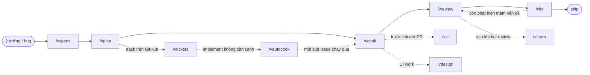

# vskills

🌐 [English](README.md) | Tiếng Việt

Bộ skill Claude Code cá nhân — checklist theo phong cách riêng, đặt lên trên các tác vụ code hằng ngày: viết specs, lập plan, implement, ship, và cả phần vận hành xung quanh (track trên GitHub, chạy tự động không cần canh, review, fix, redesign, giữ CLAUDE.md sắc bén, undo migration lỡ chạy sai).

Mỗi skill là 1 cặp `SKILL.md` (English) + `SKILL.vi.md` (tiếng Việt), gọi trực tiếp theo tên — `/vcook plans/my-feature`. Không qua plugin/marketplace, không cần file config riêng: là skill Claude Code thuần, symlink từ repo này vào `~/.claude/skills`.

## Skills

### Core pipeline — từ ý tưởng tới code đã ship

| Skill | Làm gì | Khi nào dùng |
|---|---|---|
| `vspecs` | Viết/cập nhật specs cho 1 tính năng qua vòng lặp: scout codebase + research cách người dùng thật đang làm → brainstorm edge case cùng user → ghi quyết định bằng ngôn ngữ thường (không code, không file:line, không đánh dấu trạng thái "đã làm"). | Bắt đầu feature mới, chưa có file specs. |
| `vplan` | Biến 1 file specs thành plan implementation: verify từng case với code thật (PASS/FAIL/MISSING, không đoán), thêm baseline case mà specs bỏ sót, rồi ghi `plan.md` + mỗi nhóm case 1 file `phase-XX-*.md` — migration gộp hết vào phase 1. | Đã có specs, cần 1 plan cụ thể theo từng phase để code theo. |
| `vcook` | Implement theo checklist 9 bước bắt buộc: branch → chế độ có plan/không plan → viết test trước → code đủ cả BE+FE → chỉ dùng generated SDK client (cấm raw fetch) → review theo CLAUDE.md → test xanh → commit → mở PR theo template của repo. | Đã có plan (hoặc chỉ mô tả nhanh), cần ra code chạy được + PR. |
| `vreview` | Review 1 diff/PR/branch/thư mục như senior reviewer: pre-scan lint tự động bắt buộc, rồi subagent song song theo từng nhóm file, 1 lượt tổng hợp, 1 lượt adversarial soát lại, và spot-check từng finding CRITICAL trước khi tin. Hỗ trợ review tăng dần (chỉ review lại phần đổi từ lần trước) và 1 lượt `--harvest` tùy chọn biến finding lặp lại thành lint rule mới. Ghi `.code-review/REPORT.md`, nhóm theo CRITICAL/WARNING/SUGGESTION. | Trước khi merge — review 1 branch, 1 PR đang mở, hay cả 1 thư mục. |
| `vfix` | Fix report của `vreview` theo thứ tự cố định, an toàn: vi phạm đã lint xác nhận → CRITICAL → WARNING → cross-group → SUGGESTION (hỏi từng cái, không bao giờ apply hàng loạt). Dừng lại hỏi trước bất kỳ thứ gì rủi ro — migration, fix có sửa data, hay đổi package dùng chung ≥2 app. | Đã có report `.code-review/` và cần fix mà không đoán mò thứ tự ưu tiên. |

### Mở rộng ra — track trên GitHub, chạy không cần canh

| Skill | Làm gì | Khi nào dùng |
|---|---|---|
| `vtickets` | Tạo hoặc đồng bộ 1 GitHub epic + sub-issues từ 1 plan directory — nội dung issue phi kỹ thuật, sub-issue nhóm theo các phase liên quan (không phải 1:1), migration được nêu rõ trong sub-issue nào chứa phase 1. Idempotent: chạy lại thì update chứ không tạo trùng. | Cần track 1 plan của `vplan` trên GitHub cho PM/stakeholder không rành kỹ thuật. |
| `vautocook` | Implement từng sub-issue của 1 GitHub epic theo thứ tự, không cần canh: sắp xếp thành chuỗi phụ thuộc, hiện kế hoạch cho user xác nhận, rồi chạy `/vcook` headless cô lập cho từng sub-issue (branch + PR riêng), resume được, fail-fast. Rủi ro cao theo đúng thiết kế — luôn xác nhận kế hoạch trước khi chạy. | Đã có 1 epic (ví dụ từ `vtickets`) và muốn triển khai qua đêm, không phải chạy `/vcook` từng cái một. |

### Hỗ trợ

| Skill | Làm gì | Khi nào dùng |
|---|---|---|
| `vci` | Typecheck + build + lint + format (+ test tùy chọn) cho cả repo JS/TS, chạy song song, tự phát hiện package manager/workspace/script — không hardcode tên package nào. | Check nhanh toàn repo trước khi commit/PR, ở bất kỳ repo JS/TS nào (monorepo hay single package). |
| `vdesign` | Redesign UI của 1 page/component/PR lên mức thực thi cao (tinh tế, hài hòa, hiện đại, thanh lịch, accessible). Không có flag mức độ — mỗi lần chạy đều mở đầu bằng việc hỏi user chọn 18 tiêu chí style/structure rõ ràng (typography, màu, motion, layout, độ táo bạo, và hơn thế), tổng hợp thành 1 design brief cụ thể trước khi đụng vào code. | Cần nâng cấp UI/UX của 1 page, component, feature, hoặc PR có sẵn. |
| `vlearn` | Đọc comment review của bot trên PR (1 PR, hoặc `--last N` PR đã merge), gom nhóm pattern lặp lại, đối chiếu với rule hiện có trong `CLAUDE.md`, đề xuất rule mới cho chỗ còn thiếu — đồng thời gắn cờ rule hiện có 0 lượt vi phạm gần đây là ứng viên nên gỡ. | Bot review vừa comment xong 1 PR (hoặc vài PR), đáng để rút ra thành 1 rule chuẩn. |
| `vrollback` | Rollback 1 migration trên DB **local** + xóa tracking record, như thể migration đó chưa từng chạy — tự nhận diện ORM (Drizzle/Prisma/Knex/TypeORM/raw SQL), loại DB, và container Docker. Từ chối bất cứ thứ gì không rõ ràng là local, luôn hỏi xác nhận, luôn backup trước. | Lỡ chạy nhầm migration ở local và cần xóa sạch, kể cả tracking record. |

Chi tiết đầy đủ nằm trong từng `skills/<name>/SKILL.vi.md`.

## Sơ đồ luồng



`/vrollback` chạy độc lập, dùng bất cứ khi nào cần undo migration ở local — không nằm trong pipeline này.

## Use cases

**Xây feature từ đầu tới cuối** — có ý tưởng, chưa có gì cả:
```bash
/vspecs Feature: đặt lịch tái khám
/vplan plans/specs/dat-lich-tai-kham.md
/vcook plans/dat-lich-tai-kham
/vreview
/vfix
```
→ specs → plan (migration gộp 1 phase) → code + test + PR → review 4-phase → fix theo priority.

**Fix nhanh 1 bug, không cần plan:**
```bash
/vcook Sửa lỗi datepicker không disable ngày quá khứ ở form đặt lịch
```
→ `vcook` tự nhận diện "no-plan mode": tạo nhánh, code, test, mở PR — bỏ qua bước đọc plan.

**Review branch của đồng nghiệp:**
```bash
/vreview feat/payment-refund --base develop
# hoặc review thẳng 1 PR đã mở:
/vreview #482
# hoặc thêm 1 lượt lint-harvest:
/vreview --harvest
```
→ ra `.code-review/REPORT.md`, group theo CRITICAL/WARNING/SUGGESTION; chạy lại cùng target chỉ review lại phần đổi từ lần trước.

**Trước khi mở PR, đảm bảo cả monorepo còn build:**
```bash
/vci
```
→ typecheck + build + lint + format song song mọi package trong workspace (background commands), tự fix nếu fail.

**Track 1 plan lớn cho PM/non-tech xem tiến độ trên GitHub:**
```bash
/vtickets plans/dat-lich-tai-kham
```
→ tạo epic issue + sub-issue theo nhóm phase liên quan, ngôn ngữ không thuật ngữ kỹ thuật, idempotent (chạy lại không tạo trùng).

**Implement cả epic đó không cần canh, chạy qua đêm:**
```bash
/vautocook https://github.com/<owner>/<repo>/issues/<epic_number>
```
→ sắp sub-issue thành chuỗi phụ thuộc, hiện kế hoạch cho bạn, rồi — sau khi bạn xác nhận — chạy `/vcook` headless cô lập cho từng sub-issue (branch + PR riêng), resume được, fail-fast.

**Redesign UI 1 trang:**
```bash
/vdesign /clients/[id]?tab=notes
```
→ chụp screenshot trang (hoặc đọc component tree nếu target không phải URL), hỏi 1 lần 18 câu về style/structure, audit theo checklist ~100 mục, fix hết những gì audit tìm ra, rồi verify (so sánh screenshot trước/sau, check accessibility, adversarial re-audit nếu có đổi cấu trúc).

**Bot review vừa comment xong PR — biến feedback thành rule chuẩn:**
```bash
/vlearn 482
# hoặc trên 20 PR đã merge gần nhất:
/vlearn --last 20
```
→ gom nhóm pattern comment lặp lại, đối chiếu với rule hiện có trong CLAUDE.md, đề xuất rule mới cho chỗ thật sự thiếu (không bao giờ tự áp dụng — bạn duyệt từng cái).

**Lỡ chạy nhầm migration ở local:**
```bash
/vrollback 0007_add_appointment_status
```
→ auto-detect ORM/DB/container, rollback + xoá tracking record — chỉ chạy trên DB local, luôn hỏi xác nhận trước.

## Cài đặt

```bash
git clone git@github.com:vyvu99/vskills.git
cd vskills
./install.sh                       # symlink skills/ → ~/.claude/skills (bản English)
./install.sh --lang=vi             # tương tự, nhưng cài bản dịch SKILL.vi.md
./install.sh --with-scripts        # + symlink scripts/lint-rules ở top-level (riêng tư, opt-in)
./install.sh --with-claude-md      # + copy 1 bản ~/.claude/CLAUDE.md tổng quát (opt-in, bỏ qua nếu đã có sẵn)
./install.sh --dry-run             # chỉ xem trước, không đổi gì
```

Skill được symlink chứ không copy — sửa `SKILL.md` trong `~/.claude/skills/` hay trong repo này đều là cùng 1 file. Mỗi skill đều có bản dịch tiếng Việt (`SKILL.vi.md` nằm cạnh `SKILL.md`) — chọn ngôn ngữ 1 lần lúc cài bằng `--lang`, không thể bật cả 2 cùng lúc.

Skill nào có bundle sẵn script riêng (hiện tại chỉ `vautocook` với `plan_tasks.py`/`run_tasks.py`) thì thư mục `scripts/` đó tự động được symlink theo, không cần flag gì — khác với `--with-scripts` ở trên, cái đó chỉ áp dụng cho `scripts/lint-rules/` ở top-level, opt-in (rule harvest từ `vreview` trên project riêng của tác giả, chưa chắc hợp với project của bạn).

`vreview`, `vcook`, `vlearn` đọc/ghi thẳng vào `~/.claude/CLAUDE.md` — nếu bạn chưa có file này, `--with-claude-md` sẽ copy 1 bản khởi đầu tổng quát (`claude-md/CLAUDE.md`) vào đúng chỗ. Copy chứ không symlink, vì bạn sẽ tuỳ chỉnh nó ngay sau khi cài; nếu `~/.claude/CLAUDE.md` đã tồn tại, install.sh sẽ cảnh báo và không đụng vào nó.

## Cách dùng

Mỗi skill gọi trực tiếp theo tên, vd `/vcook plans/my-feature`. Không qua plugin/marketplace — là skill Claude Code thuần.

**Quick decision tree:**

```
Tôi có 1 việc cần code
│
├─ "Cần viết specs cho 1 tính năng mới"
│  └─ /vspecs
│
├─ "Đã có specs, cần lập plan implementation"
│  └─ /vplan
│
├─ "Đã có plan (hoặc chỉ mô tả nhanh), cần code"
│  └─ /vcook
│
├─ "Cần review 1 branch/PR"
│  └─ /vreview
│
├─ "Có report review, cần fix"
│  └─ /vfix
│
├─ "Cần typecheck + build trước khi commit"
│  └─ /vci
│
├─ "Cần tạo/đồng bộ GitHub issues từ 1 plan"
│  └─ /vtickets
│
├─ "Đã có epic, muốn implement không cần canh"
│  └─ /vautocook
│
├─ "Cần redesign UI/UX"
│  └─ /vdesign
│
├─ "Bot vừa review xong 1 PR, muốn rút rule mới"
│  └─ /vlearn
│
└─ "Cần rollback 1 migration ở local"
   └─ /vrollback
```

---

## Dành cho maintainer

<details>
<summary>Cấu trúc, thêm/sync skill, lint rules</summary>

```
vskills/
├── install.sh          # symlink skills/ (+ scripts/ top-level nếu --with-scripts) vào ~/.claude
├── skills/<name>/SKILL.md       # bản English
├── skills/<name>/SKILL.vi.md    # bản tiếng Việt — cùng số dòng với SKILL.md (kiểm bởi scripts/check-skills.js)
├── skills/<name>/scripts/       # tùy chọn, luôn được cài cùng skill (vd vautocook có plan_tasks.py/run_tasks.py)
├── skills/<name>/references/    # tùy chọn, luôn được cài cùng skill (vd prompt subagent của vreview)
├── skills/_vskills-shared/repo-profile.md   # reference detect stack dùng chung, luôn symlink (không opt-in)
└── scripts/<name>/      # vd lint-rules — khác với skills/<name>/scripts/ ở trên, chỉ cài khi opt-in
```

Đã symlink — không cần bước sync thủ công. Sửa 1 skill ở `~/.claude/skills/<name>/SKILL.md` hoặc ở `skills/<name>/SKILL.md` trong repo này đều là cùng 1 file.

**Thêm skill mới:**
```bash
mkdir skills/<skill-name>
# viết skills/<skill-name>/SKILL.md (+ SKILL.vi.md, cùng số dòng)
./install.sh
node scripts/check-skills.js   # lint frontmatter, độ dài description, cân bằng dòng EN/VI
git add . && git commit -m "feat: add <skill-name> skill"
```

**Thêm lint rule sau khi `vreview` Phase 5 harvest:**

Phase 5 đã ghi (và chmod) rule script mới/cập nhật thẳng vào thư mục `~/.claude/scripts/lint-rules/rules/` — symlink từ `scripts/lint-rules/rules/` trong repo này khi cài với `--with-scripts`. Không cần bước `cp`, chỉ cần commit những gì đã có sẵn:
```bash
git add . && git commit -m "feat(lint): add <rule-name> rule"
git push
```

</details>
