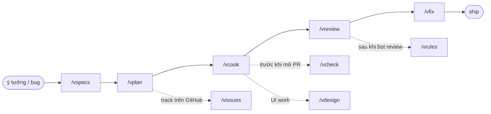

# vskills

🌐 [English](README.md) | Tiếng Việt

Bộ skill Claude Code cá nhân — checklist theo phong cách riêng, đặt lên trên các tác vụ code hằng ngày: lập plan, implement, review, fix, ship.

## Skills

| Skill | Làm gì | Khi nào dùng |
|---|---|---|
| `vspecs` | Viết/cập nhật specs cho 1 tính năng qua vòng lặp brainstorm edge case | Bắt đầu feature mới, chưa có specs |
| `vplan` | Lập plan implementation từ specs — so từng case với code hiện tại | Đã có specs, cần plan để code |
| `vcook` | Implement theo checklist 9 bước: branch, test-first, SDK client, review, PR | Đã có plan (hoặc mô tả nhanh), cần code |
| `vreview` | Code review 6-phase bằng subagent song song + adversarial pass | Cần review 1 branch/PR |
| `vfix` | Fix issue từ report của `vreview` theo thứ tự ưu tiên cố định | Có report review cần fix |
| `vcheck` | Typecheck + build song song cho JS/TS workspace (mọi package manager) | Check nhanh trước khi commit |
| `vissues` | Tạo/update GitHub epic + sub-issues từ 1 plan | Cần track plan trên GitHub |
| `vdesign` | Redesign UI/UX theo thẩm mỹ cá nhân (3 mức độ sâu `--L1`-`--L3`, cộng thêm `--bold`) | Cần nâng cấp UI 1 page/component |
| `vrules` | Rút pattern từ PR review của bot → đề xuất rule mới cho CLAUDE.md | Bot vừa review xong 1 PR |
| `vmigrate-rollback` | Rollback 1 migration trên DB local + xoá tracking record | Cần undo 1 migration ở local |

Chi tiết đầy đủ nằm trong từng `skills/<name>/SKILL.vi.md`.

## Sơ đồ luồng



`/vmigrate-rollback` chạy độc lập, dùng bất cứ khi nào cần undo migration ở local — không nằm trong pipeline này.

## Use cases

**Xây feature từ đầu tới cuối** — có ý tưởng, chưa có gì cả:
```bash
/vspecs Feature: đặt lịch tái khám
/vplan plans/specs/dat-lich-tai-kham.md
/vcook plans/dat-lich-tai-kham
/vreview
/vfix
```
→ specs → plan (migration gộp 1 phase) → code + test + PR → review 6-phase → fix theo priority.

**Fix nhanh 1 bug, không cần plan:**
```bash
/vcook Sửa lỗi datepicker không disable ngày quá khứ ở form đặt lịch
```
→ `vcook` tự nhận diện "no-plan mode": tạo nhánh, code, test, mở PR — bỏ qua bước đọc plan.

**Review branch của đồng nghiệp:**
```bash
/vreview feat/payment-refund --base develop
# hoặc review thẳng 1 PR đã mở:
/vreview #482
```
→ ra `.code-review/REPORT.md`, group theo CRITICAL/WARNING/SUGGESTION.

**Trước khi mở PR, đảm bảo cả monorepo còn build:**
```bash
/vcheck
```
→ typecheck + build song song mọi package trong workspace (background commands), tự fix nếu fail.

**Track 1 plan lớn cho PM/non-tech xem tiến độ trên GitHub:**
```bash
/vissues plans/dat-lich-tai-kham
```
→ tạo epic issue + sub-issue theo nhóm phase, ngôn ngữ không thuật ngữ kỹ thuật, idempotent (chạy lại không tạo trùng).

**Lỡ chạy nhầm migration ở local:**
```bash
/vmigrate-rollback 0007_add_appointment_status
```
→ auto-detect ORM/DB/container, rollback + xoá tracking record — chỉ chạy trên DB local, luôn hỏi xác nhận trước.

## Cài đặt

```bash
git clone git@github.com:vyvu99/vskills.git
cd vskills
./install.sh                       # symlink skills/ → ~/.claude/skills (bản English)
./install.sh --lang=vi             # tương tự, nhưng cài bản dịch SKILL.vi.md
./install.sh --with-scripts        # + symlink scripts/lint-rules (riêng tư, opt-in)
./install.sh --with-claude-md      # + copy 1 bản ~/.claude/CLAUDE.md tổng quát (opt-in, bỏ qua nếu đã có sẵn)
./install.sh --dry-run             # chỉ xem trước, không đổi gì
```

Skill được symlink chứ không copy — sửa `SKILL.md`/`SKILL.vi.md` trong `~/.claude/skills/` hay trong repo này đều là cùng 1 file. `scripts/lint-rules/` mặc định KHÔNG cài: đó là rule harvest từ `vreview` trên project riêng của tác giả, chưa chắc hợp với project của bạn. Mỗi skill đều có bản dịch tiếng Việt (`SKILL.vi.md` nằm cạnh `SKILL.md`) — chọn ngôn ngữ 1 lần lúc cài bằng `--lang`, không thể bật cả 2 cùng lúc.

`vreview`, `vcook`, `vrules` đọc/ghi thẳng vào `~/.claude/CLAUDE.md` — nếu bạn chưa có file này, `--with-claude-md` sẽ copy 1 bản khởi đầu tổng quát (`claude-md/CLAUDE.md`) vào đúng chỗ. Copy chứ không symlink, vì bạn sẽ tuỳ chỉnh nó ngay sau khi cài; nếu `~/.claude/CLAUDE.md` đã tồn tại, install.sh sẽ cảnh báo và không đụng vào nó.

## Cách dùng

Mỗi skill gọi trực tiếp theo tên, vd `/vcook plans/my-feature`. Không qua plugin/marketplace — là skill Claude Code thuần.

**Quick decision tree:**

```
Tôi có 1 việc cần code
│
├─ "Cần viết specs cho 1 tính năng mới"
│  └─ /vspecs
│
├─ "Đã có specs, cần lập plan implementation"
│  └─ /vplan
│
├─ "Đã có plan (hoặc chỉ mô tả nhanh), cần code"
│  └─ /vcook
│
├─ "Cần review 1 branch/PR"
│  └─ /vreview
│
├─ "Có report review, cần fix"
│  └─ /vfix
│
├─ "Cần typecheck + build trước khi commit"
│  └─ /vcheck
│
├─ "Cần tạo/đồng bộ GitHub issues từ 1 plan"
│  └─ /vissues
│
├─ "Cần redesign UI/UX"
│  └─ /vdesign
│
├─ "Bot vừa review xong 1 PR, muốn rút rule mới"
│  └─ /vrules
│
└─ "Cần rollback 1 migration ở local"
   └─ /vmigrate-rollback
```

---

## Dành cho maintainer

<details>
<summary>Cấu trúc, thêm/sync skill, lint rules</summary>

```
vskills/
├── install.sh          # symlink skills/ (+ scripts/ nếu có --with-scripts) vào ~/.claude
├── skills/<name>/SKILL.md       # bản English
├── skills/<name>/SKILL.vi.md    # bản tiếng Việt
├── skills/_vskills-shared/repo-profile.md   # reference detect stack dùng chung, luôn symlink (không opt-in)
└── scripts/<name>/      # vd lint-rules, chỉ cài khi opt-in
```

Đã symlink — không cần bước sync thủ công. Sửa 1 skill ở `~/.claude/skills/<name>/SKILL.md` hoặc ở `skills/<name>/SKILL.md` trong repo này đều là cùng 1 file.

**Thêm skill mới:**
```bash
mkdir skills/<skill-name>
# viết skills/<skill-name>/SKILL.md (và SKILL.vi.md nếu muốn có bản dịch)
./install.sh
git add . && git commit -m "feat: add <skill-name> skill"
```

**Thêm lint rule sau khi `vreview` Phase 5 harvest:**
```bash
cp .code-review/staged-lint-rules/*.sh scripts/lint-rules/rules/
git add . && git commit -m "feat(lint): add <rule-name> rule"
git push
```

</details>
