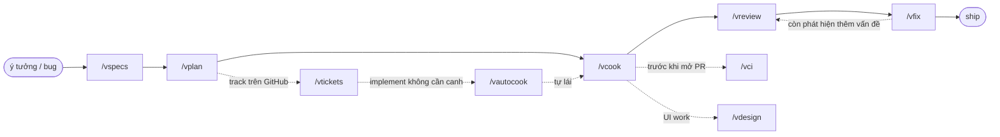

# vskills

🌐 [English](README.md) | Tiếng Việt

Bộ skill Claude Code cá nhân, bao trọn vòng đời 1 task code: viết specs, lập plan, implement, review, fix, ship — cộng thêm track trên GitHub, redesign UI, và rollback migration ở local.

File `SKILL.md` thuần, symlink từ repo này vào `~/.claude/skills`. Không qua plugin, không có config. Mỗi skill có 2 bản: English (`SKILL.md`) và tiếng Việt (`SKILL.vi.md`).

## Cài đặt

**Yêu cầu:** Claude Code CLI, `git`, `bash`. `gh` là tùy chọn — skill liên quan GitHub vẫn chạy được ở mức giảm khi thiếu.

```bash
git clone git@github.com:vyvu99/vskills.git
cd vskills
./install.sh                       # symlink skills/ → ~/.claude/skills (bản English)
./install.sh --lang=vi             # bản tiếng Việt
./install.sh --with-scripts        # + lint rule cá nhân (opt-in)
./install.sh --with-claude-md      # + starter ~/.claude/CLAUDE.md tổng quát (opt-in, bỏ qua nếu đã có)
./install.sh --dry-run             # chỉ xem trước
```

Skill được symlink chứ không copy — sửa ở đâu cũng là cùng 1 file. Chạy lại `install.sh` sẽ dọn skill nào đã bị xóa khỏi repo từ lần cài trước.

## Skills

`*` — chỉ chạy khi gọi tay; assistant không tự động dùng.

### Core pipeline

| Skill | Làm gì | Ví dụ |
|---|---|---|
| `vspecs` | Viết/cập nhật specs: research codebase + cách người dùng thật đang làm, rồi cùng bạn đi qua từng edge case. Output chỉ ngôn ngữ thường — không code, không file:line. | `/vspecs Feature: đặt lịch tái khám` |
| `vplan` | Biến 1 file specs thành plan theo từng phase, verify từng case với code thật (PASS/FAIL/MISSING). | `/vplan plans/specs/dat-lich-tai-kham.md` |
| `vcook`* | Implement 1 plan hoặc task từ đầu tới cuối: branch, viết test trước, code, chỉ dùng generated SDK, review theo CLAUDE.md, mở PR. Dừng lại nếu working tree dơ hoặc plan lệch code. | `/vcook plans/dat-lich-tai-kham` |
| `vreview` | Review 1 diff/PR/branch/thư mục: pre-scan lint, review song song theo file, tổng hợp, và 1 lượt adversarial. Ghi `.code-review/REPORT.md`. | `/vreview #482` |
| `vfix`* | Fix report của `vreview` theo thứ tự ưu tiên — lint, Critical, Warning, cross-group, Suggestion. Dừng lại hỏi trước bất kỳ thứ gì rủi ro. | `/vfix` |

### Track trên GitHub

| Skill | Làm gì | Ví dụ |
|---|---|---|
| `vtickets`* | Tạo hoặc đồng bộ 1 GitHub epic + sub-issues từ 1 plan directory. Idempotent. | `/vtickets plans/dat-lich-tai-kham` |
| `vautocook`* | Implement từng sub-issue của 1 GitHub epic không cần canh, mỗi sub-issue 1 PR riêng. Cần xác nhận trước khi chạy; không có phương án dự phòng nếu thiếu `gh`/`claude`. | `/vautocook <epic-url>` |

### Hỗ trợ

| Skill | Làm gì | Ví dụ |
|---|---|---|
| `vci` | Typecheck, build, lint song song cho cả repo JS/TS; format và test tùy chọn chạy sau. Tự phát hiện package manager/workspace. | `/vci --changed` |
| `vdesign` | Redesign UI 1 page/component qua quy trình scan → audit → fix → verify. Luôn mở đầu bằng 18 câu hỏi style. | `/vdesign /clients/[id]` |
| `vrollback`* | Rollback 1 migration đã chạy trên DB xác nhận là local + xóa tracking record. Từ chối target không rõ local. | `/vrollback 0007_add_status` |

Chi tiết đầy đủ, flag, edge case: `skills/<name>/SKILL.vi.md`.

## Sơ đồ luồng


```mermaid
flowchart LR
    idea(["ý tưởng / bug"]) --> specs["/vspecs"]
    specs --> plan["/vplan"]
    plan --> cook["/vcook"]
    cook --> review["/vreview"]
    review --> fix["/vfix"]
    fix -. còn phát hiện thêm vấn đề .-> review
    fix --> ship(["ship"])

    plan -. track trên GitHub .-> tickets["/vtickets"]
    tickets -. implement không cần canh .-> auto["/vautocook"]
    auto -. tự lái .-> cook
    cook -. trước khi mở PR .-> ci["/vci"]
    cook -. UI work .-> design["/vdesign"]
```

`/vrollback` chạy độc lập — không nằm trong pipeline này.

## Cần skill nào?

```
├─ Viết specs cho feature mới           → /vspecs
├─ Biến specs thành plan                → /vplan
├─ Implement 1 plan hoặc task nhanh     → /vcook
├─ Review 1 branch/PR                   → /vreview
├─ Fix 1 report review                  → /vfix
├─ Typecheck/build trước khi commit     → /vci
├─ Track 1 plan trên GitHub             → /vtickets
├─ Implement 1 epic GitHub không cần canh → /vautocook
├─ Redesign UI 1 trang                  → /vdesign
└─ Rollback 1 migration ở local         → /vrollback
```

---

## Dành cho maintainer

<details>
<summary>Cấu trúc, thêm/xóa skill, lint rules</summary>

```
vskills/
├── install.sh                    # symlink skills/ (+ scripts/ nếu --with-scripts) vào ~/.claude
├── skills/<name>/SKILL.md        # bản English
├── skills/<name>/SKILL.vi.md     # bản tiếng Việt, cùng số dòng (kiểm bởi scripts/check-skills.js)
├── skills/<name>/scripts/        # tùy chọn, cài cùng skill
├── skills/<name>/references/     # tùy chọn, cài cùng skill
├── skills/_vskills-shared/       # reference dùng chung, luôn symlink
└── scripts/<name>/               # vd lint-rules — opt-in, khác với skills/<name>/scripts/
```

**Thêm skill mới:**
```bash
mkdir skills/<skill-name>
# viết skills/<skill-name>/SKILL.md (+ SKILL.vi.md, cùng số dòng)
./install.sh
node scripts/check-skills.js   # lint frontmatter, độ dài description, cân bằng EN/VI
git add . && git commit -m "feat: add <skill-name> skill"
```

**Xóa 1 skill:**
```bash
rm -rf skills/<skill-name>
grep -rl "<skill-name>" skills/ README.md README.vi.md   # bắt cross-reference còn sót
./install.sh   # tự dọn symlink mồ côi dưới ~/.claude/skills
git add . && git commit -m "chore: remove <skill-name> skill"
```

**Thêm lint rule sau 1 lượt `vreview --harvest`:**

Phase 5 ghi thẳng rule script vào `~/.claude/scripts/lint-rules/rules/` (symlink từ `scripts/lint-rules/rules/` khi cài với `--with-scripts`) — chỉ cần commit những gì đã có sẵn:
```bash
git add . && git commit -m "feat(lint): add <rule-name> rule"
git push
```

</details>

## License

[MIT](LICENSE)
