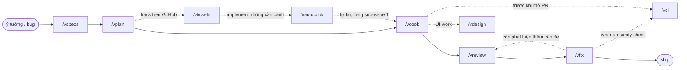

# vskills

🌐 [English](README.md) | Tiếng Việt

**Bộ skill Claude Code cá nhân cho toàn bộ vòng đời 1 task code** — viết specs, lập plan, implement, review, fix, ship, cộng cả phần vận hành xung quanh (track trên GitHub, chạy tự động không cần canh, redesign UI, giữ `CLAUDE.md` sắc bén, undo migration lỡ chạy sai).

Cố tình opinionated: mỗi skill mã hoá 1 cách làm cụ thể, đã kiểm chứng qua thực tế cho 1 loại task — không phải 1 menu tuỳ chọn. Không qua plugin/marketplace, không cần file config riêng: là file `SKILL.md` thuần, symlink từ repo này vào `~/.claude/skills`, gọi trực tiếp theo tên (`/vcook plans/my-feature`).

## Tại sao có repo này

Prompt tuỳ hứng kiểu "review giúp PR này" hay "implement plan này" cho kết quả không ổn định — chất lượng phụ thuộc vào việc hôm đó mình diễn đạt tốt tới đâu. Mỗi skill ở đây là 1 checklist cố định, đã được kiểm chứng cho 1 task lặp lại, nên cùng 1 input luôn ra cùng 1 mức độ kỹ lưỡng: `vreview` luôn pre-scan lint trước khi đụng vào diff, `vcook` luôn viết test trước khi code, `vfix` luôn fix theo đúng thứ tự ưu tiên an toàn. Bạn không cần giải thích lại chuẩn của mình ở mỗi prompt nữa.

Mỗi skill có 2 bản ngôn ngữ — `SKILL.md` (English) và `SKILL.vi.md` (tiếng Việt), khớp số dòng, được CI kiểm tra — chọn 1 bản lúc cài.

## Skills

Ký hiệu 👤 cạnh tên nghĩa là skill đó chỉ chạy khi bạn tự gõ — assistant không tự động dùng (`disable-model-invocation: true`). Các skill còn lại thì assistant có thể tự chọn dùng khi thấy hợp.

### Core pipeline — từ ý tưởng tới code đã ship

| Skill | Làm gì | Khi nào dùng |
|---|---|---|
| `vspecs` | Viết/cập nhật specs cho 1 tính năng qua vòng lặp: 2 subagent recon tách biệt (scout codebase + research thực tế người dùng — cố tình tách riêng) → phân loại tình huống rồi **dừng lại chờ bạn xác nhận** → nhiều vòng brainstorm edge case (P0/P1/P2, chat hoặc webapp tự sinh) → 1 giai đoạn Experience Specs (user thấy gì/làm gì/cảm nhận gì) → 1 lượt self-check (6 kiểm tra bắt buộc; câu hỏi nào treo quá 3 vòng bị ép chốt). Output chỉ ngôn ngữ thường — không code, không file:line, không đánh dấu trạng thái "đã làm"; specs giới hạn ~1-3 trang, quá thì tách file. | Bắt đầu feature mới, chưa có file specs, hoặc đối chiếu lại specs với code đã build sẵn. |
| `vplan` | Đọc đủ 1 file specs + scout codebase, rồi verify **từng** case với code thật — PASS/FAIL/MISSING kèm file:line, không đoán — thêm baseline edge case mà specs bỏ sót, rồi ghi `plan.md` + mỗi nhóm case 1 file `phase-XX-*.md` (migration mặc định gộp vào 1 phase 1 duy nhất, trừ khi 1 migration chứng minh được là độc lập). 1 lượt cross-check cuối bắt lỗi case bị bỏ sót/phase mồ côi, rồi đưa ra 3 lựa chọn: implement ngay, track trên GitHub trước, hoặc dừng ở đây. | Đã có specs, cần 1 plan cụ thể theo từng phase để code theo. |
| `vcook` 👤 | Implement theo checklist 9 bước bắt buộc: chốt branch + PR base → nhận diện chế độ có plan/không plan → viết test fail trước (bắt buộc với backend/API, chỉ bỏ qua cho UI thuần với lý do rõ ràng) → code đủ cả BE+FE → chỉ dùng generated SDK client (cấm raw `fetch`/`axios`) → review toàn bộ diff theo CLAUDE.md → chạy hết suite tới khi xanh, rồi thực sự gọi thử 1 lần → commit → mở PR theo template của repo. **Dừng cứng** nếu working tree dơ hoặc plan lệch code thật trước khi viết dòng code nào; resume được sau khi bị gián đoạn; không có `gh` thì hạ cấp xuống in PR body để dán tay. | Đã có plan (hoặc chỉ mô tả nhanh), cần ra code chạy được + PR. |
| `vreview` | Review 1 diff/PR/branch/thư mục như senior reviewer: pre-scan lint tự động bắt buộc, rồi subagent song song theo từng nhóm file, 1 lượt tổng hợp, 1 lượt adversarial soát lại, và spot-check **toàn bộ** finding CRITICAL (không chỉ finding từ lượt adversarial) trước khi tin. Hỗ trợ review tăng dần (chỉ review lại phần đổi từ lần trước — chạy lại đúng commit cũ thì chỉ replay report cũ) và 1 lượt `--harvest` tùy chọn biến finding lặp lại thành lint rule mới. Ghi `.code-review/REPORT.md`, nhóm theo CRITICAL/WARNING/SUGGESTION/CROSS-GROUP. | Trước khi merge — review 1 branch, 1 PR đang mở, hay cả 1 thư mục. |
| `vfix` 👤 | Fix report của `vreview` theo thứ tự cố định, an toàn: vi phạm đã lint xác nhận → CRITICAL → WARNING → cross-group → SUGGESTION (hỏi từng cái, hoặc duyệt qua 1 webapp danh sách hàng loạt — nhưng cả 2 cách đều không tự apply hàng loạt). Dừng lại hỏi trước bất kỳ thứ gì rủi ro — migration, UPDATE/DELETE trên data sẵn có, hay đổi package dùng chung ≥2 app. Ghi status ngược vào report ngay khi fix xong, chạy `vci` trên package đã đụng, và hỏi trước khi xoá `.code-review/`. | Đã có report `.code-review/` và cần fix mà không đoán mò thứ tự ưu tiên. |

### Mở rộng ra — track trên GitHub, chạy không cần canh

| Skill | Làm gì | Khi nào dùng |
|---|---|---|
| `vtickets` 👤 | Tạo hoặc đồng bộ 1 GitHub epic + sub-issues từ 1 plan directory — nội dung issue phi kỹ thuật, sub-issue nhóm theo mảng công việc liên quan (không phải 1:1 theo phase), migration được nêu rõ trong sub-issue nào chứa phase 1. Idempotent hoàn toàn — chuỗi phát hiện cache file + hidden marker + title search nghĩa là chạy lại chỉ update chứ không tạo trùng — và hạ cấp xuống in nội dung issue để dán tay nếu thiếu GitHub/`gh`, thay vì bỏ chạy. Không bao giờ tạo label GitHub mới mà không hỏi trước. | Cần track 1 plan của `vplan` trên GitHub cho PM/stakeholder không rành kỹ thuật. |
| `vautocook` 👤 | Implement từng sub-issue của 1 GitHub epic theo thứ tự, không cần canh: lên kế hoạch chuỗi phụ thuộc, hiện cho bạn xem và **dừng cứng chờ xác nhận rõ ràng**, rồi chạy `/vcook` headless cô lập cho từng sub-issue (branch + PR riêng, xếp chồng lên branch của sub-issue phụ thuộc), resume được, fail-fast ngay khi 1 task kết thúc mà không ra PR. Không có chế độ hạ cấp — cần 1 epic GitHub thật (vd từ `vtickets`), `gh` đã đăng nhập, và CLI `claude` có trong PATH; sau khi xác nhận có thể chạy không cần canh vài giờ liền. | Đã có 1 epic và muốn triển khai qua đêm, không phải chạy `/vcook` từng cái một. |

### Hỗ trợ

| Skill | Làm gì | Khi nào dùng |
|---|---|---|
| `vci` | Typecheck, build, lint chạy song song theo từng package; format và test tùy chọn chạy sau. Tự phát hiện package manager/workspace/script (ưu tiên `turbo`/`nx` nếu có config ở root) — không hardcode tên package nào. `--changed` giới hạn theo package bị đụng từ base branch trở lên; package nào fail thì fix xong chỉ chạy lại đúng package đó, và chạy lại sau khi bị gián đoạn thì tái dùng log cũ thay vì chạy từ đầu. | Check nhanh toàn repo trước khi commit/PR, ở bất kỳ repo JS/TS nào (monorepo hay single package). |
| `vdesign` | Redesign UI của 1 page/component/PR lên mức thực thi cao (tinh tế, hài hòa, hiện đại, thanh lịch, accessible) qua 5 giai đoạn có tên — Scope → Scan → Audit (checklist ~100 mục) → Fix → Verify. Không có flag mức độ — **mọi** lần chạy đều mở đầu bằng 18 câu hỏi style/structure rõ ràng (typography, màu, motion, layout, độ táo bạo, và hơn thế; chat hoặc webapp tự sinh), tổng hợp thành 1 design brief cụ thể trước khi đụng vào code. Target nhiều component thì redesign 1 cụm pilot trước, chờ bạn duyệt, rồi mới lan design language đó ra phần còn lại. Kết thúc bằng so sánh screenshot, check accessibility, và 1 cổng anti-slop bắt buộc (không gradient chung chung, không data giả, không 3+ card giống hệt nhau). | Cần nâng cấp UI/UX của 1 page, component, feature, hoặc PR có sẵn. |
| `vrollback` 👤 | Rollback 1 migration **đã chạy** trên DB **xác nhận là local** + xóa tracking record, như thể migration đó chưa từng chạy — tự nhận diện ORM (Drizzle/Prisma/Knex/TypeORM/raw SQL), loại DB, và container Docker. Từ chối thẳng nếu host DB không rõ ràng là local, mặc định backup trước (chỉ bỏ qua nếu bạn nói rõ không cần), và luôn bắt gõ đúng tên DB để xác nhận — kể cả khi bạn bảo "cứ làm luôn, khỏi hỏi" cũng không bỏ qua bước đó. | Lỡ chạy nhầm migration ở local và cần xóa sạch, kể cả tracking record. |

Chi tiết đầy đủ nằm trong từng `skills/<name>/SKILL.vi.md`.

### Vài điều nên biết trước khi chạy

- `vcook` từ chối chạy nếu working tree đang dơ, và dừng ngay giữa chừng nếu plan lệch với code thật — không bao giờ tự ý biến tấu vượt qua 2 điều đó.
- `vautocook` là skill duy nhất **không có đường lùi**: thiếu epic GitHub, thiếu `gh` đã đăng nhập, hoặc thiếu CLI `claude` trong PATH là dừng thẳng — và sau khi bạn duyệt kế hoạch, nó chạy không cần canh (có thể vài giờ) với `--dangerously-skip-permissions`, không hỏi lại từng task.
- `vrollback` không bao giờ chấp nhận "cứ làm luôn, khỏi hỏi" — luôn bắt gõ đúng tên DB, và từ chối thẳng nếu host DB không rõ ràng là local.
- `vtickets` và `vdesign --pr` hạ cấp êm khi thiếu `gh` (in ra thứ lẽ ra đã làm thay vì bỏ chạy); `vautocook` ở trên là ngoại lệ duy nhất không có đường lùi này.
- `vreview` luôn pre-scan lint trước khi đụng vào diff; chạy lại đúng commit cũ thì chỉ replay report cũ chứ không review lại từ đầu.
- `vfix` không bao giờ apply hàng loạt 1 SUGGESTION, và không bao giờ xoá `.code-review/` mà không hỏi trước.

## Sơ đồ luồng


```mermaid
flowchart LR
    idea(["ý tưởng / bug"]) --> specs["/vspecs"]
    specs --> plan["/vplan"]
    plan --> cook["/vcook"]
    cook --> review["/vreview"]
    review --> fix["/vfix"]
    fix -. còn phát hiện thêm vấn đề .-> review
    fix -. wrap-up sanity check .-> ci["/vci"]
    fix --> ship(["ship"])

    plan -. track trên GitHub .-> tickets["/vtickets"]
    tickets -. implement không cần canh .-> auto["/vautocook"]
    auto -. tự lái, từng sub-issue 1 .-> cook
    cook -. trước khi mở PR .-> ci
    cook -. UI work .-> design["/vdesign"]
```

`/vrollback` chạy độc lập, dùng bất cứ khi nào cần undo migration ở local — không nằm trong pipeline này.

## Use cases

**Xây feature từ đầu tới cuối** — có ý tưởng, chưa có gì cả:
```bash
/vspecs Feature: đặt lịch tái khám
/vplan plans/specs/dat-lich-tai-kham.md
/vcook plans/dat-lich-tai-kham
/vreview
/vfix
```
→ specs → plan (migration gộp 1 phase) → code + test + PR → review 4-phase → fix theo priority.

**Fix nhanh 1 bug, không cần plan:**
```bash
/vcook Sửa lỗi datepicker không disable ngày quá khứ ở form đặt lịch
# gắn luôn với 1 issue đang track:
/vcook Sửa lỗi datepicker không disable ngày quá khứ --issue 512
```
→ `vcook` tự nhận diện "no-plan mode": tạo nhánh, code, test, mở PR — bỏ qua bước đọc plan. `--issue` thêm `Closes #512` vào PR body.

**Review branch của đồng nghiệp:**
```bash
/vreview feat/payment-refund --base develop
# hoặc review thẳng 1 PR đã mở:
/vreview #482
# hoặc review theo khoảng thời gian hay thư mục tuỳ ý, không cần diff:
/vreview --since 2h
/vreview --path apps/api/src/services
# hoặc thêm 1 lượt lint-harvest:
/vreview --harvest
```
→ ra `.code-review/REPORT.md`, group theo CRITICAL/WARNING/SUGGESTION; chạy lại cùng target chỉ review lại phần đổi từ lần trước.

**Fix report review mà không cần đoán thứ tự ưu tiên:**
```bash
/vfix
```
→ mặc định đọc `.code-review/`, fix theo đúng thứ tự vi phạm đã lint xác nhận → CRITICAL → WARNING → cross-group → SUGGESTION, dừng lại hỏi trước bất kỳ thứ gì rủi ro (migration, sửa data, đổi package dùng chung).

**Trước khi mở PR, đảm bảo cả monorepo còn build:**
```bash
/vci
# hoặc chỉ chạy đúng phần bạn vừa đụng, kèm test:
/vci --changed --test
```
→ typecheck + build + lint chạy song song theo từng package (format + test tùy chọn chạy sau), tự phát hiện package manager/workspace, tự fix nếu fail.

**Track 1 plan lớn cho PM/non-tech xem tiến độ trên GitHub:**
```bash
/vtickets plans/dat-lich-tai-kham
```
→ tạo epic issue + sub-issue theo nhóm mảng công việc liên quan, ngôn ngữ không thuật ngữ kỹ thuật, idempotent (chạy lại không tạo trùng).

**Implement cả epic đó không cần canh, chạy qua đêm:**
```bash
/vautocook https://github.com/<owner>/<repo>/issues/<epic_number>
```
→ sắp sub-issue thành chuỗi phụ thuộc, hiện kế hoạch cho bạn, rồi — sau khi bạn xác nhận — chạy `/vcook` headless cô lập cho từng sub-issue (branch + PR riêng), resume được, fail-fast.

**Redesign UI 1 trang:**
```bash
/vdesign /clients/[id]?tab=notes
# cũng nhắm được vào tên component, 1 URL đang chạy, file đổi trong 1 PR, hay 1 screenshot dán vào:
/vdesign TreatmentPlanWizard
/vdesign --pr
```
→ chụp screenshot trang (hoặc đọc component tree nếu target không phải URL), hỏi 1 lần 18 câu về style/structure, audit theo checklist ~100 mục, fix hết những gì audit tìm ra (target nhiều component thì redesign 1 cụm pilot trước, chờ bạn duyệt), rồi verify (so sánh screenshot trước/sau, check accessibility, adversarial re-audit nếu có đổi cấu trúc).

**Lỡ chạy nhầm migration ở local:**
```bash
/vrollback 0007_add_appointment_status
```
→ auto-detect ORM/DB/container, rollback + xoá tracking record — chỉ chạy trên DB local, luôn hỏi xác nhận trước.

## Cài đặt

**Yêu cầu:** Claude Code CLI, `git`, `bash`. `gh` là tùy chọn — các skill có đụng GitHub (`vtickets`, `vautocook`, tra cứu PR trong `vcook`/`vreview`/`vdesign`) vẫn chạy được ở mức giảm khi thiếu `gh`, xem ghi chú riêng của từng skill.

```bash
git clone git@github.com:vyvu99/vskills.git
cd vskills
./install.sh                       # symlink skills/ → ~/.claude/skills (bản English)
./install.sh --lang=vi             # tương tự, nhưng cài bản dịch SKILL.vi.md
./install.sh --with-scripts        # + symlink scripts/lint-rules ở top-level (riêng tư, opt-in)
./install.sh --with-claude-md      # + copy 1 bản ~/.claude/CLAUDE.md tổng quát (opt-in, bỏ qua nếu đã có sẵn)
./install.sh --dry-run             # chỉ xem trước, không đổi gì
```

Skill được symlink chứ không copy — sửa `SKILL.md` trong `~/.claude/skills/` hay trong repo này đều là cùng 1 file. Chạy lại `./install.sh` cũng tự dọn skill nào đã bị xóa khỏi repo này từ lần cài trước, nên `~/.claude/skills` không bao giờ tích tụ entry mồ côi.

Skill nào có bundle sẵn script riêng (hiện tại chỉ `vautocook` với `plan_tasks.py`/`run_tasks.py`) thì thư mục `scripts/` đó tự động được symlink theo, không cần flag gì — khác với `--with-scripts` ở trên, cái đó chỉ áp dụng cho `scripts/lint-rules/` ở top-level, opt-in (rule harvest từ `vreview` trên project riêng của tác giả, chưa chắc hợp với project của bạn).

`vreview` và `vcook` đọc/ghi thẳng vào `~/.claude/CLAUDE.md` — nếu bạn chưa có file này, `--with-claude-md` sẽ copy 1 bản khởi đầu tổng quát (`claude-md/CLAUDE.md`) vào đúng chỗ. Copy chứ không symlink, vì bạn sẽ tuỳ chỉnh nó ngay sau khi cài; nếu `~/.claude/CLAUDE.md` đã tồn tại, `install.sh` sẽ cảnh báo và không đụng vào nó.

## Cách dùng

Mỗi skill gọi trực tiếp theo tên, vd `/vcook plans/my-feature`. Không qua plugin/marketplace — là skill Claude Code thuần.

**Quick decision tree:**

```
Tôi có 1 việc cần code
│
├─ "Cần viết specs cho 1 tính năng mới"
│  └─ /vspecs
│
├─ "Đã có specs, cần lập plan implementation"
│  └─ /vplan
│
├─ "Đã có plan (hoặc chỉ mô tả nhanh), cần code"
│  └─ /vcook
│
├─ "Cần review 1 branch/PR"
│  └─ /vreview
│
├─ "Có report review, cần fix"
│  └─ /vfix
│
├─ "Cần typecheck + build trước khi commit"
│  └─ /vci
│
├─ "Cần tạo/đồng bộ GitHub issues từ 1 plan"
│  └─ /vtickets
│
├─ "Đã có epic, muốn implement không cần canh"
│  └─ /vautocook
│
├─ "Cần redesign UI/UX"
│  └─ /vdesign
│
└─ "Cần rollback 1 migration ở local"
   └─ /vrollback
```

---

## Dành cho maintainer

<details>
<summary>Cấu trúc, thêm/sync skill, lint rules</summary>

```
vskills/
├── install.sh          # symlink skills/ (+ scripts/ top-level nếu --with-scripts) vào ~/.claude
├── skills/<name>/SKILL.md       # bản English
├── skills/<name>/SKILL.vi.md    # bản tiếng Việt — cùng số dòng với SKILL.md (kiểm bởi scripts/check-skills.js)
├── skills/<name>/scripts/       # tùy chọn, luôn được cài cùng skill (vd vautocook có plan_tasks.py/run_tasks.py)
├── skills/<name>/references/    # tùy chọn, luôn được cài cùng skill (vd prompt subagent của vreview)
├── skills/_vskills-shared/      # reference dùng chung, luôn symlink (không opt-in)
└── scripts/<name>/      # vd lint-rules — khác với skills/<name>/scripts/ ở trên, chỉ cài khi opt-in
```

Đã symlink — không cần bước sync thủ công. Sửa 1 skill ở `~/.claude/skills/<name>/SKILL.md` hoặc ở `skills/<name>/SKILL.md` trong repo này đều là cùng 1 file.

**Thêm skill mới:**
```bash
mkdir skills/<skill-name>
# viết skills/<skill-name>/SKILL.md (+ SKILL.vi.md, cùng số dòng)
./install.sh
node scripts/check-skills.js   # lint frontmatter, độ dài description, cân bằng dòng EN/VI
git add . && git commit -m "feat: add <skill-name> skill"
```

**Xóa 1 skill:**
```bash
rm -rf skills/<skill-name>
grep -rl "<skill-name>" skills/ README.md README.vi.md   # bắt hết cross-reference còn sót (footer Next-steps, use case, v.v.)
./install.sh   # tự dọn symlink mồ côi dưới ~/.claude/skills
git add . && git commit -m "chore: remove <skill-name> skill"
```

**Thêm lint rule sau khi `vreview` Phase 5 harvest:**

Phase 5 đã ghi (và chmod) rule script mới/cập nhật thẳng vào thư mục `~/.claude/scripts/lint-rules/rules/` — symlink từ `scripts/lint-rules/rules/` trong repo này khi cài với `--with-scripts`. Không cần bước `cp`, chỉ cần commit những gì đã có sẵn:
```bash
git add . && git commit -m "feat(lint): add <rule-name> rule"
git push
```

</details>

## License

[MIT](LICENSE)
